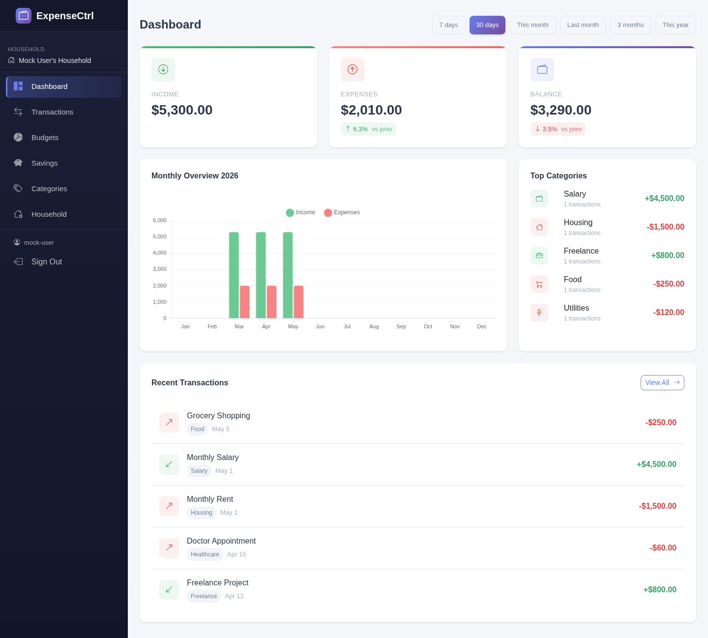
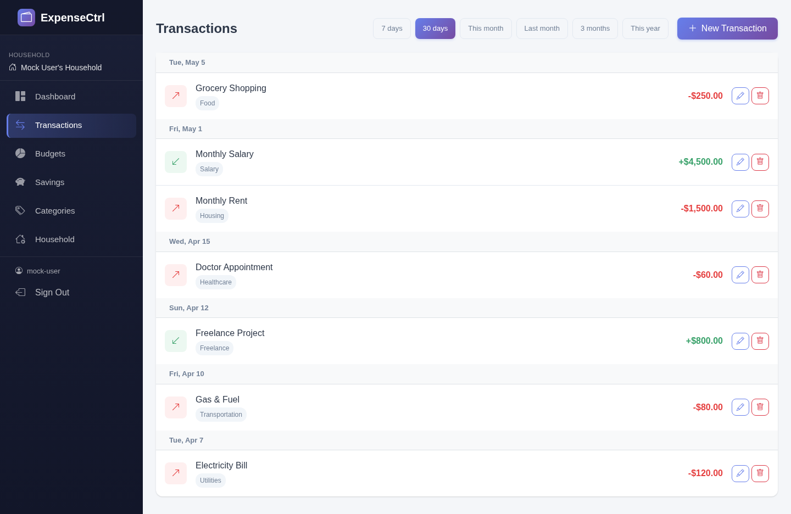
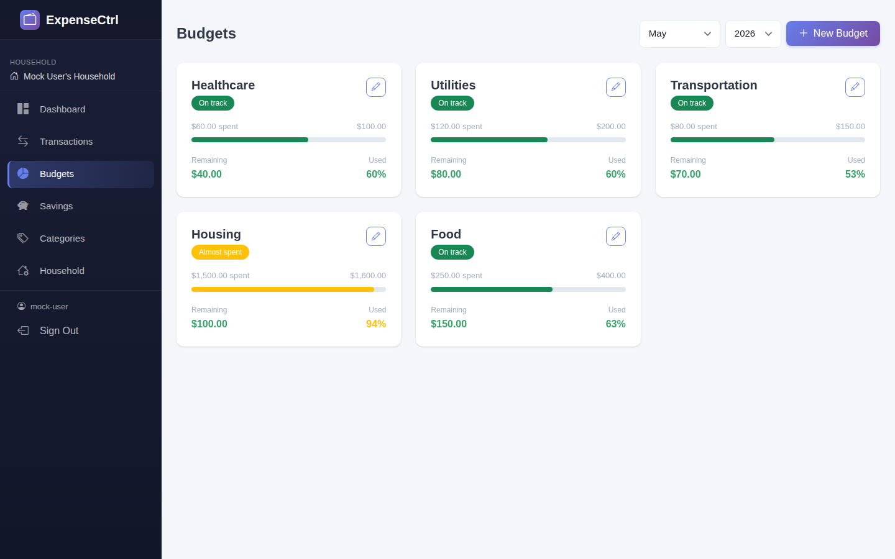
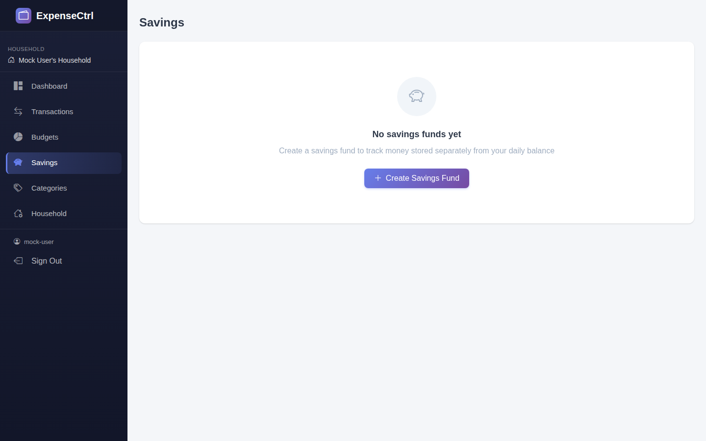
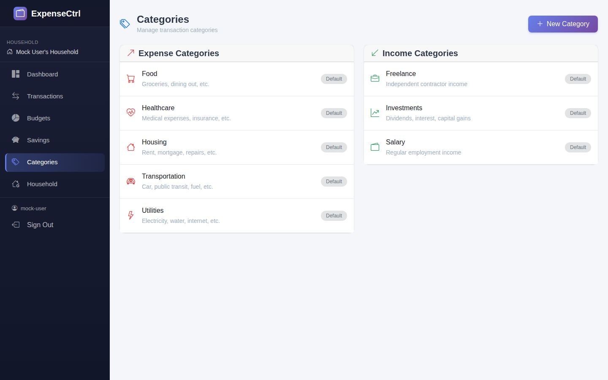
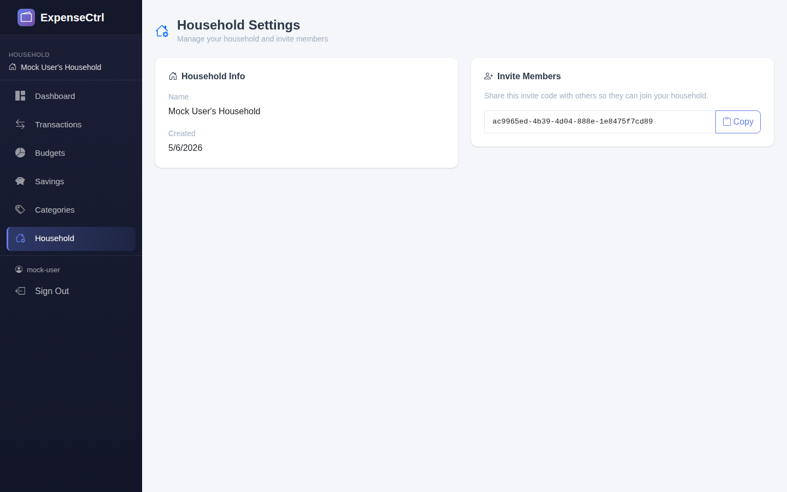

# Expense Control

Expense Control is a personal finance application for tracking income, expenses, budgets, savings, and household data, built with a .NET 10 Minimal API backend and a React 19 frontend.

## Features
- **Authentication**: AWS Cognito support plus mock authentication for local development.
- **Dashboard**: Financial summary, monthly trend, category insights, and recent transactions.
- **Transactions**: Create, edit, list, and delete income/expense transactions.
- **Budgets**: Monthly category budgets with usage indicators.
- **Savings Goals**: Create and manage savings targets and progress.
- **Categories**: Organize transaction and budget categories.
- **Households**: Household setup, membership, and invite-based joining.

## Screenshots
### Dashboard


### Transactions


### Budgets


### Savings


### Categories


### Household


## Project Structure
```text
Backend/
  ExpenseControl.Api/        # .NET 10 Web API (Minimal APIs)
  ExpenseControl.Api.Tests/  # xUnit tests

Frontend/
  ExpenseControl.React/      # React + TypeScript + Vite frontend
```

## Getting Started

### Prerequisites
- [.NET 10 SDK](https://dotnet.microsoft.com/download)
- [Node.js 20+](https://nodejs.org/)
- Docker (for PostgreSQL)

### Local development

1. Start PostgreSQL:
   ```bash
   docker compose up -d expensecontrol-postgres
   ```
2. Run the API:
   ```bash
   ASPNETCORE_ENVIRONMENT=Development \
   ConnectionStrings__DefaultConnection="Host=localhost;Database=ExpenseControlDb;Username=postgres;Password=ExpenseControl123!" \
   dotnet run --project Backend/ExpenseControl.Api --urls http://localhost:5293
   ```
3. Run the frontend:
   ```bash
   cd Frontend/ExpenseControl.React
   npm install
   VITE_USE_MOCK_AUTH=true npm run dev
   ```

App URLs:
- Frontend: `http://localhost:5173`
- API: `http://localhost:5293`
- API health: `http://localhost:5293/health`
- Swagger (Development): `http://localhost:5293/swagger`

### Docker Compose (full stack)
```bash
docker compose up --build
```
> The frontend container is configured with `VITE_USE_MOCK_AUTH=false`, so Cognito settings are required in that flow.

## Tech Stack
- **Backend**: .NET 10 Minimal APIs, Entity Framework Core, Npgsql
- **Frontend**: React 19, TypeScript, Vite, Bootstrap
- **Database**: PostgreSQL
- **Tests**: xUnit, Playwright

## Testing

Run backend tests:
```bash
dotnet test
```

Run frontend lint and build:
```bash
cd Frontend/ExpenseControl.React
npm run lint
npm run build
```

Run frontend end-to-end tests:
```bash
npx playwright install chromium
npm run test:e2e
```

Current automated test scope includes **133 backend unit tests** and **87 frontend end-to-end tests**.

## Contributing
Pull requests and issues are welcome.
